# Exporting SolidWorks to URDF

## Installing SolidWorks for Free on Windows
(Include installation steps, TBD)

## Steps to Create URDF from SolidWorks

### 1. Open the Assembly File
- Open the `.SLDASM` file from `hardware/follower/SolidWorks` or `hardware/leader/SolidWorks`.

   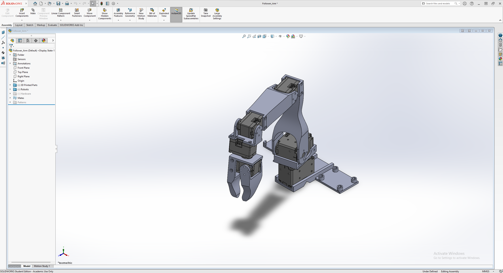

### 2. Group Parts
- Hide the parts you don't want grouped together by right-clicking and selecting "Hide."

   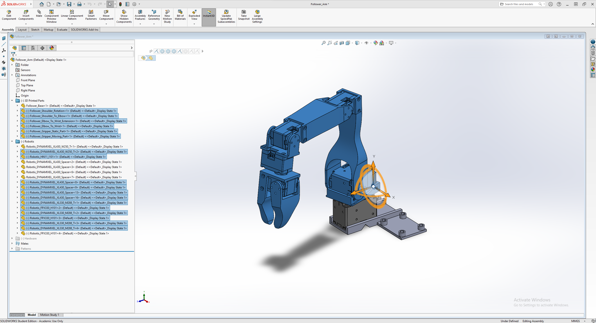

   

- Save the remaining parts in a separate folder as `.SLDPRT` files. Name them systematically, e.g., `base_link`, `link_1`, etc., for easier tracking.

   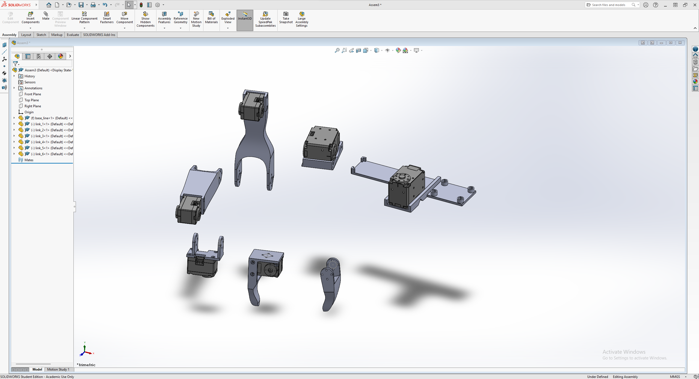

### 3. Modify Parts for Rotational Joints
- For parts that need rotational joints, open the corresponding part and draw a circular sketch. This circle should be tangent to the through-hole cylinders (holes for screws) to define the axis of rotation in the assembly.

   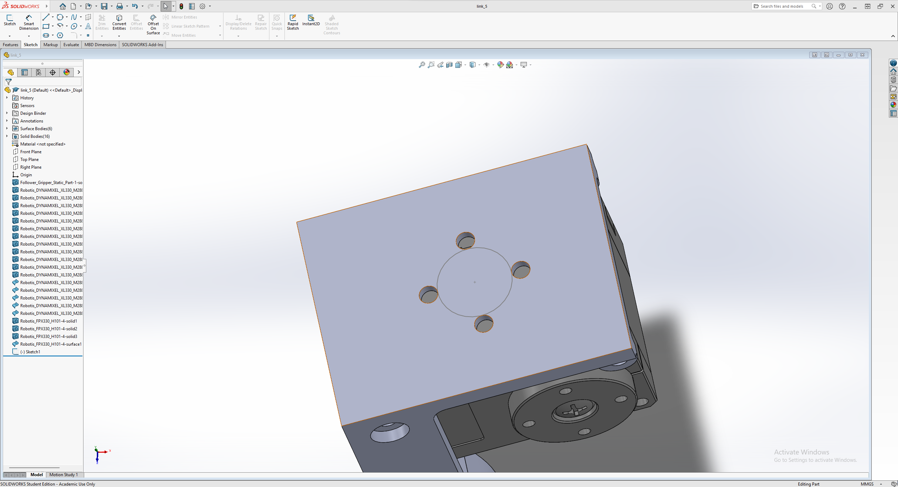

- Save each modified part.

### 4. Create a New Assembly in SolidWorks
1. Open SolidWorks and create a new assembly.
2. Insert the saved parts and start assembling them using the **Mate** tool.
   - Start from `base_link` and link it to `link_1` using the **coincident mate** for surfaces.

      

   - For rotational joints, use **concentric mate** for the cylindrical surfaces.

      

3. Continue assembling the remaining links using the parts you previously modified.

   

4. Align the robot arm using the **Mate** tool to make links parallel/perpendicular to each other.
   
   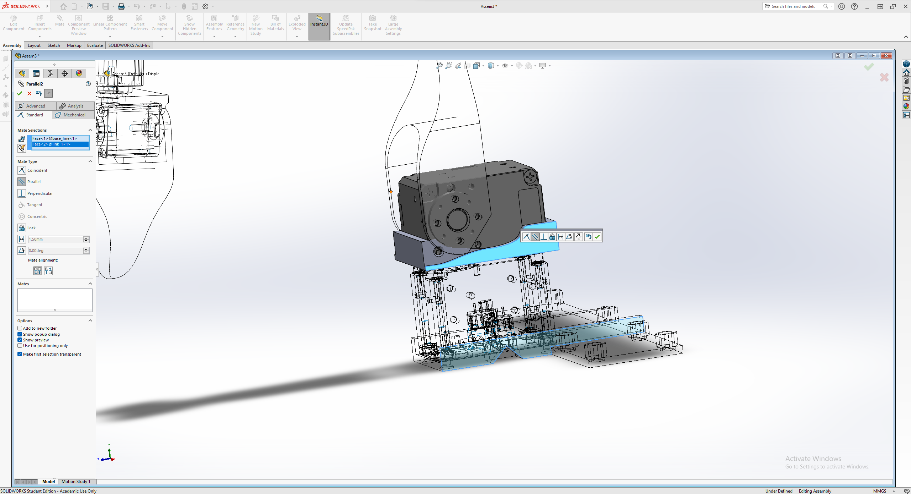

   - After alignment, delete the parallel mate constraints to restore link movement while keeping the alignment.

      

      

5. Save the assembly regularly to avoid losing progress.

### 5. Define Coordinate Systems and Joint Axes
1. **Global Coordinate System:**
   - Use the **Reference Geometry** tool to define `x`, `y`, and `z` axes by selecting edges of the `base_link`.

      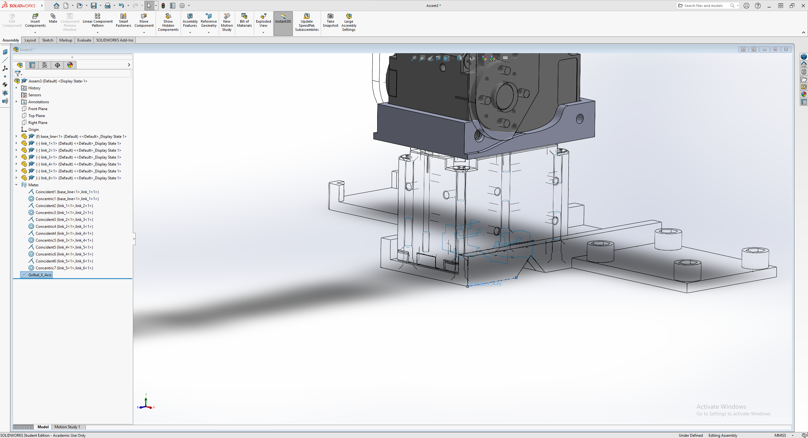

   - Define a **Reference Point** for the global origin, ideally at the center of the arm's base and at the lower point.

      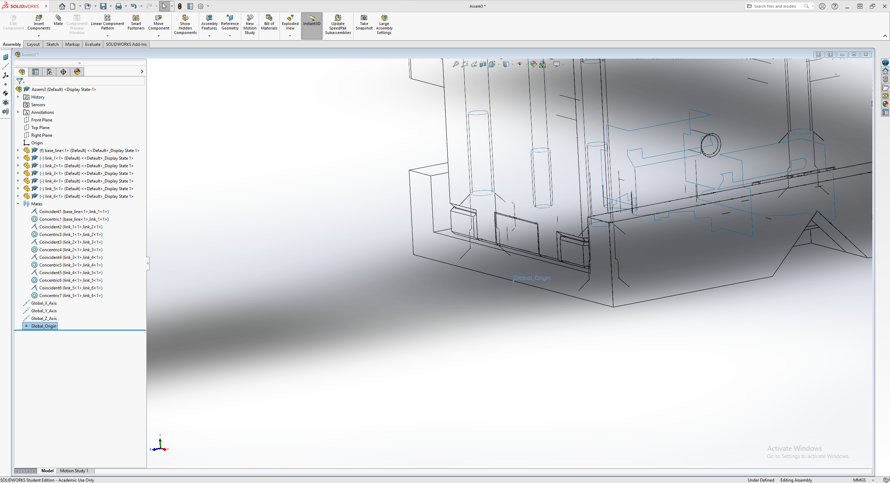

   - Create a **Coordinate System** using the point and axes defined above. Set the axis for this coordinate system using the global axes defined before. Ensure the global coordinate system follows the standard 3D frame (z-axis pointing upward, y-axis pointing away from you, and x-axis pointing right). Use the flip button in SolidWorks if necessary to adjust the orientations. Name this system `global_coordinates_system` for better tracking.

      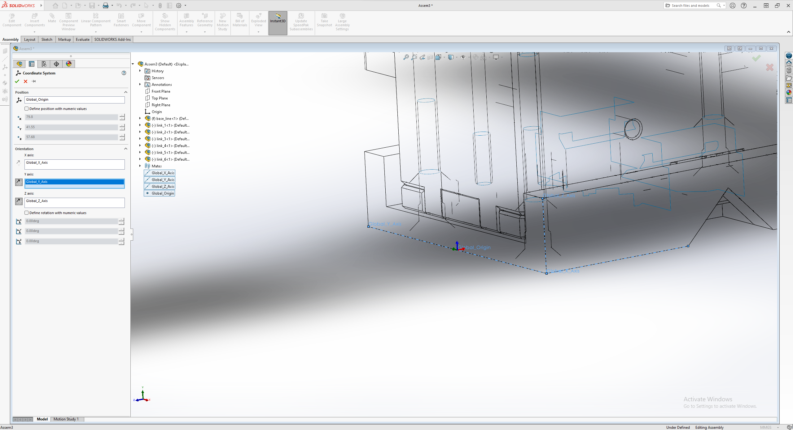

2. **Joint Axis and Link Frames:**
   - For each link, define the joint axis using the cylinder of rotation and name it (e.g., `joint_1`).

      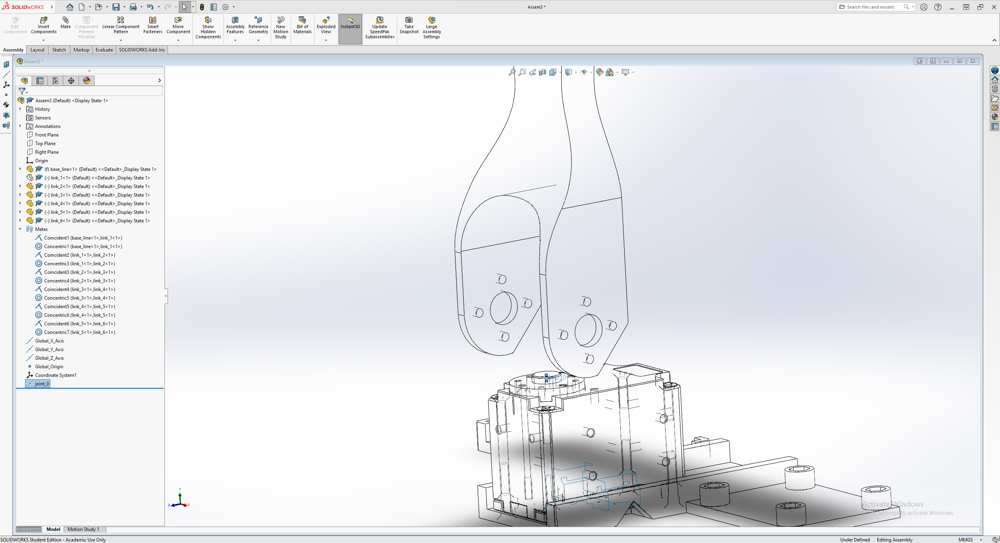

   - Define a **Reference Point** at the intersection of the joint axis and link surface.

      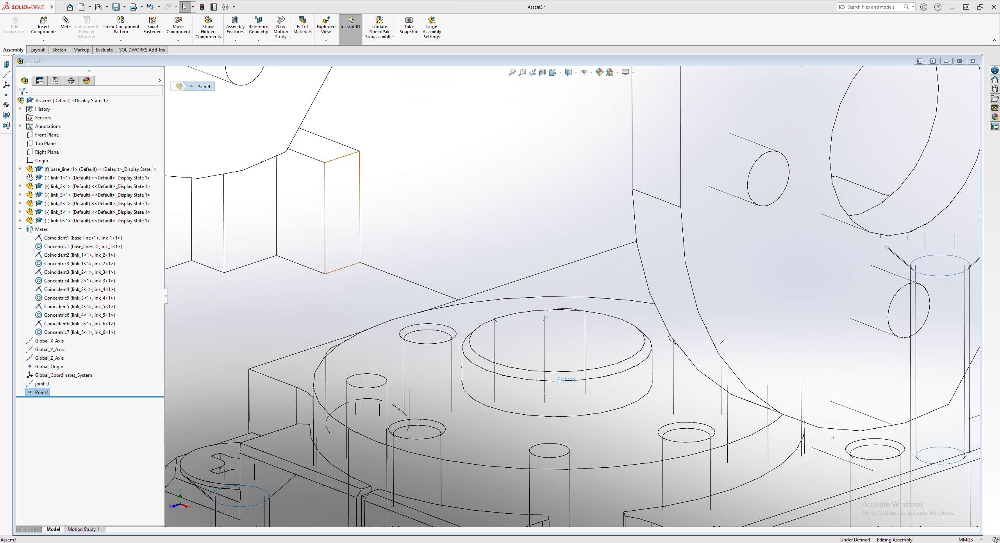

   - Create a **Coordinate System** for each link. Select the defined point as the origin and orient it using the appropriate axis. Ensure it aligns with the global coordinate system. Name it accordingly, e.g., `link_1_coordinates_system`, for better tracking.

      
   
   - Repeat for all joints/links.
  
All coordinates systems and joints axis:

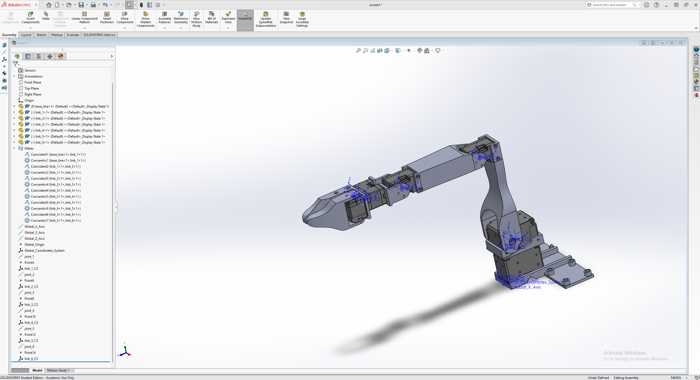

### 6. Export to URDF
1. Open the **URDF Exporter** from the **Tools** menu.
2. Set the base link (`base_link`) by selecting the global coordinate system manually.

   

3. Increase the number of children by one (e.g., `link_1`).
4. Choose the empty link, give it a name, and name the joint as well (e.g., `joint_1`). Select the appropriate coordinate system and axis.
5. Set the joint type (e.g., revolute).

   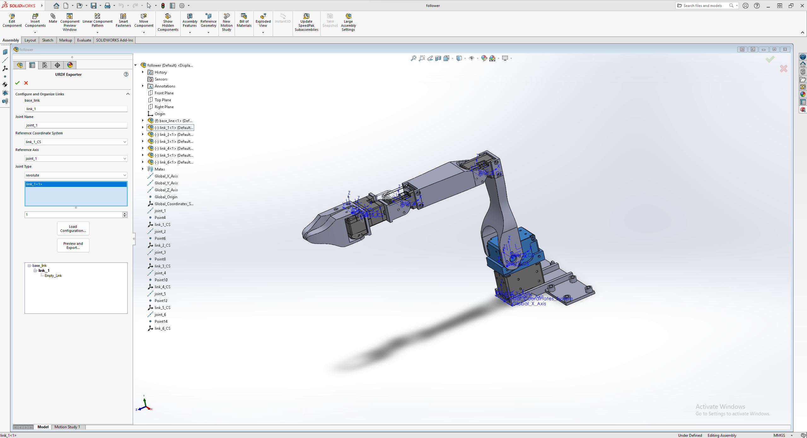

6. Repeat for all links and joints up to `link_6`.

   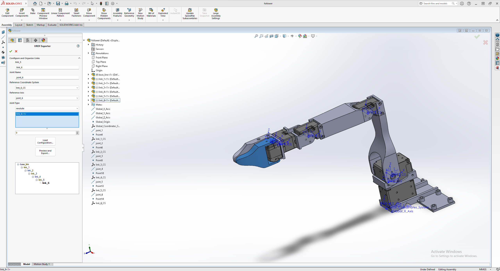

7. Click **Preview** and export.

### 7. Finalizing URDF Export
1. In the limits popup, set joint values:

   

   - **Limits**: (-3.14, 3.14)
   - **Effort**: 100
   - **Velocity**: 0.5
   - Use specific values for the final link if needed (e.g., from Alex Koch files: (-2.45, 0.032), (0.5), (100)), then click **Next**.

2. Review the moments of inertia (default values are typically fine).

   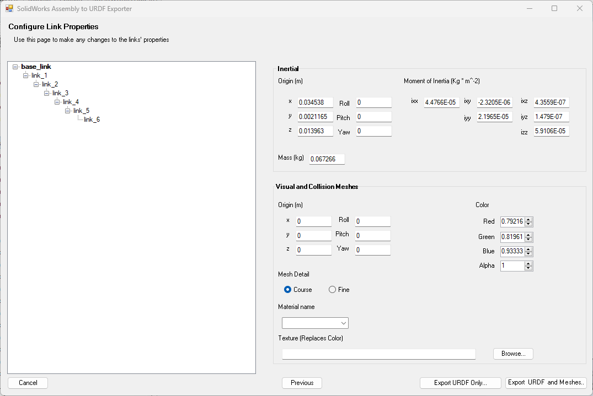

3. Click on Export URDF and meshes.

   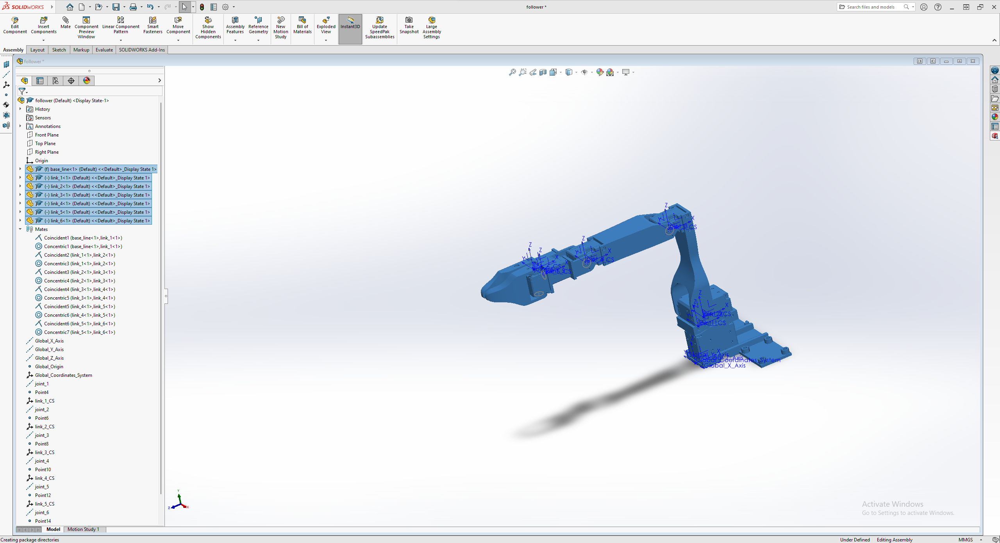

   The image below shows how the exported files are organized. You can find the URDF file in the `urdf` folder and the `.stl` files in the `meshes` folder.

   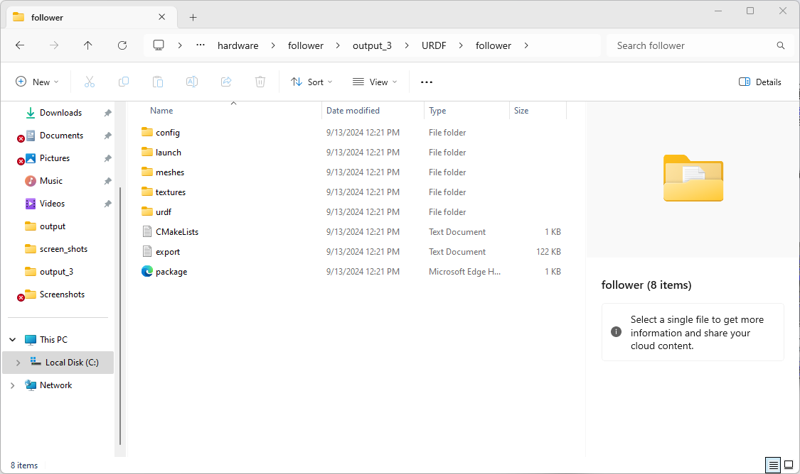


You can verify if your URDF file is working by using the Mujoco viewer. If you have installed Mujoco via pip, you can run the viewer with the following command:

```bash
python -m mujoco.viewer
```


### 8. Converting URDF to Mujoco XML (MJCF)
- Follow conversion steps from URDF to Mujoco XML format.